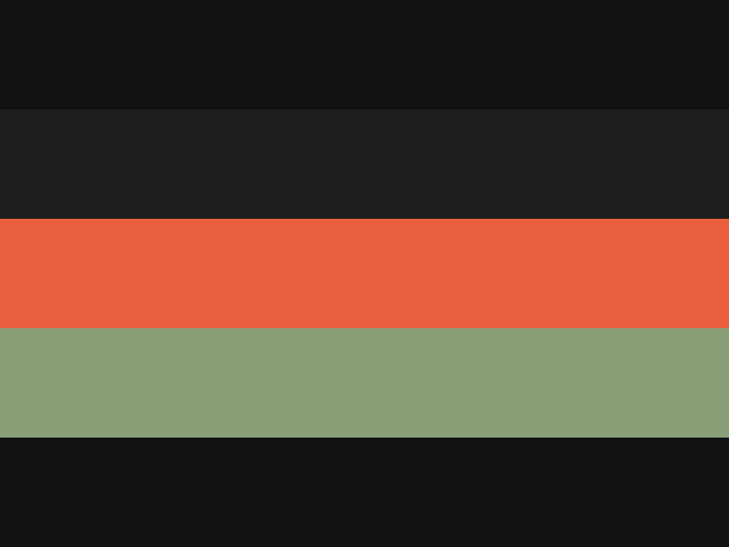
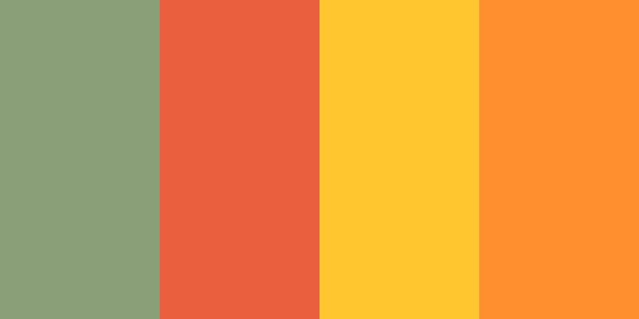
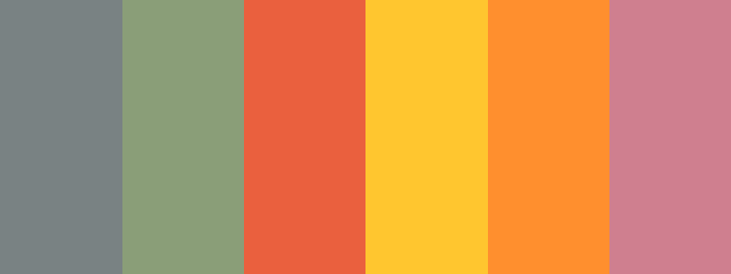

# PixelFactory

[](https://marketplace.visualstudio.com/items?itemName=apassanisi.pixel-factory)
[](https://marketplace.visualstudio.com/items?itemName=apassanisi.pixel-factory)
[](https://marketplace.visualstudio.com/items?itemName=apassanisi.pixel-factory)
[](https://github.com/apassanisi/pixel-factory/blob/main/LICENSE)
[](https://github.com/apassanisi/pixel-factory/releases)

A warm, cohesive color theme for VS Code with sophisticated syntax highlighting and comprehensive UI colors. Dark theme with orange accents and muted tones for comfortable, extended coding sessions.

## Preview

### Editor Theme


### Syntax Highlighting


### Terminal Colors


## Quick Start

**Install from VS Code Marketplace:**
1. Open Extensions (`Ctrl+Shift+X` / `Cmd+Shift+X`)
2. Search for "PixelFactory"
3. Click Install
4. Open Command Palette (`Ctrl+Shift+P`)
5. Type "Color Theme" and select a theme

**Or install via CLI:**
```bash
code --install-extension apassanisi.pixel-factory
```

## Features

✨ **Warm, Sophisticated Design**
- Deep dark backgrounds (`#121212`, `#1e1e1e`) reduce eye strain
- Warm orange accent color (`#FF8F2E`) for interactive elements
- Muted, complementary syntax colors for readability

🎨 **Comprehensive Color Coverage**
- 220+ carefully selected colors for every UI element
- Full terminal ANSI color support
- Consistent git decoration colors
- Complete debugging and chat UI theming

🔤 **Optimized Syntax Highlighting**
- Comments: `#5f5f5f` (muted gray)
- Strings: `#8A9E78` (sage green)
- Keywords: `#ea603e` (warm red)
- Numbers: `#CF7F8F` (mauve)
- Storage: `#FFC62F` (golden yellow)
- Operations: `#FF8F2E` (bright orange)

♿ **Accessibility First**
- WCAG AA compliant contrast ratios (4.5:1 for text)
- Tested with WebAiM contrast checker
- Support for colorblind-friendly design

## Installation

### Via VS Code Marketplace
1. Open Extensions in VS Code (`Ctrl+Shift+X` / `Cmd+Shift+X`)
2. Search for "PixelFactory"
3. Click Install

### Manual Installation
1. Clone this repository:
   ```bash
   git clone https://github.com/apassanisi/pixel-factory ~/.vscode/extensions/pixel-factory
   ```
2. Reload VS Code

## Usage

1. Open Command Palette (`Ctrl+Shift+P` / `Cmd+Shift+P`)
2. Type "Color Theme"
3. Select one of:
   - **PixelFactory Dark** - Editor + syntax highlighting
   - **PixelFactory Studio** - Enhanced variant with optimized token colors
   - **PixelFactory Light** - Light mode variant

## Color Palette Reference

### Core Backgrounds
| Role | Color | Usage |
|---|---|---|
| Primary | `#121212` | Editor, activity bar, panels |
| Secondary | `#1e1e1e` | Sidebars, status bar, widgets |
| Tertiary | `#2a2a2a` | Selections, active items, tabs |
| Quaternary | `#3a3a3a` | Hover states, focus backgrounds |

### Syntax Colors
| Element | Color | Scope |
|---|---|---|
| Comments | `#5f5f5f` | Muted gray for reduced prominence |
| Strings | `#8A9E78` | Sage green for string literals |
| Keywords | `#ea603e` | Warm red for language keywords |
| Numbers | `#CF7F8F` | Mauve for numeric literals |
| Storage | `#FFC62F` | Golden yellow for declarations |
| Operators | `#FF8F2E` | Bright orange for operators |
| Punctuation | `#7f7b66` | Brown for brackets, delimiters |
| Functions/Classes | `#798283` | Gray-blue for identifiers |

### Status & Feedback
| State | Color | Usage |
|---|---|---|
| Error | `#C71B00` | Error backgrounds and foregrounds |
| Warning | `#FFC62F` | Warning indicators |
| Success | `#A6E22E` | Added/inserted lines, success states |
| Modified | `#E6DB74` | Modified files and lines |
| Deleted | `#F85931` | Deleted files and lines |
| Info | `#798283` | Informational text |

### Interactive Elements
| Element | Color | Meaning |
|---|---|---|
| Active Border | `#FF8F2E` | Focused/active UI state |
| Focus Border | `#7f7b66` | Focus rings and borders |
| Selection | `#3a3a3a` | Text selection background |
| Hover | `#2a2a2a` | Hover backgrounds |

## Terminal Colors

Full ANSI color support for terminal outputs:
- **Black**: `#121212`
- **Red**: `#F85931`
- **Green**: `#A6E22E`
- **Yellow**: `#FFC62F`
- **Blue**: `#798283`
- **Magenta**: `#CF7F8F`
- **Cyan**: `#8A9E78`
- **White**: `#798283`

## Customization

To customize the theme, create a `settings.json` override:

```json
{
  "workbench.colorCustomizations": {
    "[PixelFactory Studio]": {
      "editor.background": "#0a0a0a",
      "editor.foreground": "#a0a0a0"
    }
  }
}
```

## File Structure

```
pixel-factory/
├── package.json          # Extension metadata
├── README.md            # This file
├── LICENSE              # MIT License
├── themes/
│   ├── Editor.json                    # Base UI colors (220+ colors)
│   ├── PixelFactory.json              # Syntax highlighting + Editor.json
│   ├── PixelFactory-Studio.json        # Finalized theme with overrides
│   ├── PixelFactory-Light.json         # Light mode variant
│   └── PixelFactory-HighContrast.json  # High contrast variant
└── images/
    └── icon.png         # Theme icon
```

## Design Philosophy

PixelFactory is built on principles of:

1. **Warmth** - Orange and warm tones reduce harsh blues and cool colors
2. **Readability** - High contrast ratios for all text and code
3. **Consistency** - Cohesive color usage across all UI elements
4. **Accessibility** - WCAG compliant color choices
5. **Modular** - Three theme variants for different preferences

## Contributing

Contributions are welcome! Please:

1. Fork the repository
2. Create a feature branch (`git checkout -b feature/your-feature`)
3. Make your changes to the JSON theme files
4. Test thoroughly in VS Code
5. Submit a pull request

## Changelog

### 1.0.0 (2026-02-15)
- Initial release
- 4 theme variants (PixelFactory Dark, Studio, Light, High Contrast)
- 220+ colors with comprehensive coverage
- Full terminal ANSI support
- Terminal, debugging, and chat UI theming

## License

MIT © 2026 apassanisi

## Support

Have feedback, questions, or found a bug? Let us know!

- **GitHub Issues:** [Report bugs & request features](https://github.com/apassanisi/pixel-factory/issues)
- **Discussions:** [Share ideas & feedback](https://github.com/apassanisi/pixel-factory/discussions)
- **Email:** sndhl@github.com

## Showcase Your Setup

Using PixelFactory? Show it off! Share your screenshots on:
- [GitHub Discussions](https://github.com/apassanisi/pixel-factory/discussions)
- [Visual Studio Marketplace Reviews](https://marketplace.visualstudio.com/items?itemName=apassanisi.pixel-factory#review-details)

## Acknowledgments

Built with careful attention to color theory, accessibility standards, and community feedback.

---

**Made with ❤️ by [apassanisi](https://github.com/apassanisi)**

**Enjoy coding with PixelFactory!** 🎨

MIT © 2026 apassanisi
